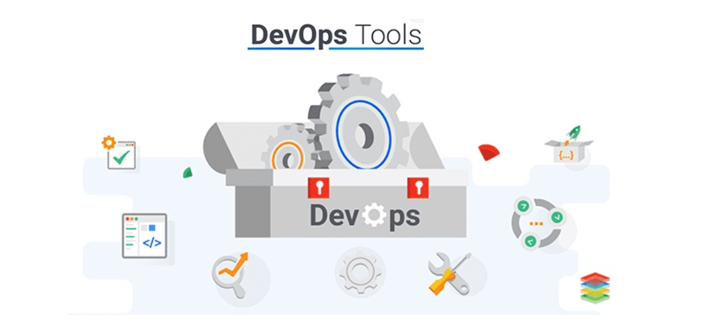

# DevOps System Setup:-

|  |
| --------- |

| Windows System on which below application was Installed ? |
| --------- |
| Microsoft Windows Server 2022 Datacenter Azure Edition. |

1. __Install Chocolatey on Windows.__

| Reference Link: https://chocolatey.org/install |
| --------- |

```
Set-ExecutionPolicy Bypass -Scope Process -Force; `
[System.Net.ServicePointManager]::SecurityProtocol = `
[System.Net.ServicePointManager]::SecurityProtocol -bor 3072; `
iex ((New-Object System.Net.WebClient).DownloadString('https://community.chocolatey.org/install.ps1'))
```

| Validate Post Installation:- |
| --------- |

```
choco --version
```

2. __Install Winget on Windows.__

| Reference Link: https://learn.microsoft.com/en-us/windows/package-manager/winget/ |
| --------- |

🔥 Important Note: __Refer to the Github Link where I have raised issue - https://github.com/asheroto/winget-install/issues/64__ 

```
Install-PackageProvider -Name NuGet -Force
Install-Module -Name Microsoft.WinGet.Client -Force -Repository PSGallery
Repair-WinGetPackageManager -AllUsers
```

| Validate Post Installation:- |
| --------- |

```
winget
```

3. __Install VSCODE on Windows.__

| Reference Link: https://community.chocolatey.org/packages/vscode |
| --------- |

```
choco install vscode
```

4. __Install GIT on Windows.__

| Reference Link: https://community.chocolatey.org/packages/vscode](https://community.chocolatey.org/packages/git.install |
| --------- |

```
choco install git.install
```

| Git Configuration after Installation:- |
| --------- |
| __Reference Link: https://git-scm.com/book/ms/v2/Getting-Started-First-Time-Git-Setup__ |

```
git config --list
```

```
git config --global user.name "Arindam Mitra"
git config --global user.email mail2arindam2003@yahoo.com
git config --global init.defaultBranch main
```

```
git config --list
```

5. __Install PyCharm IDE (Community Edition) on Windows.__

| Reference Link: https://community.chocolatey.org/packages/pycharm-community |
| --------- |

```
choco install pycharm-community
```

6. __Install Terraform CLI on Windows.__

| Reference Link: https://winstall.app/apps/Hashicorp.Terraform |
| --------- |

```
winget install --id=Hashicorp.Terraform  -e --accept-source-agreements
```

| Terraform Installation Logs:- |
| --------- |

```
PS C:\Users\amadmin> winget install --id=Hashicorp.Terraform  -e --accept-source-agreements

The `msstore` source requires that you view the following agreements before using.
Terms of Transaction: https://aka.ms/microsoft-store-terms-of-transaction
The source requires the current machine's 2-letter geographic region to be sent to the backend service to function properly (ex. "US").

Found HashiCorp Terraform [Hashicorp.Terraform] Version 1.11.4
This application is licensed to you by its owner.
Microsoft is not responsible for, nor does it grant any licenses to, third-party packages.
Downloading https://releases.hashicorp.com/terraform/1.11.4/terraform_1.11.4_windows_amd64.zip
  ██████████████████████████████  26.8 MB / 26.8 MB
Successfully verified installer hash
Extracting archive...
Successfully extracted archive
Starting package install...
Command line alias added: "terraform"
Path environment variable modified; restart your shell to use the new value.
Successfully installed

PS C:\Users\amadmin>
```

7. __Install AzCLI Core on Windows.__

| Reference Link: https://community.chocolatey.org/packages/azure-cli |
| --------- |

```
choco install azure-cli -y
```

8. __Install Powershell Core on Windows.__

| Reference Link: https://winget.run/pkg/Microsoft/PowerShell |
| --------- |

```
winget install -e --id Microsoft.PowerShell
```

| Powershell Installation Logs:- |
| --------- |

```
PS C:\Users\amadmin> winget install -e --id Microsoft.PowerShell

Found PowerShell [Microsoft.PowerShell] Version 7.5.1.0
This application is licensed to you by its owner.
Microsoft is not responsible for, nor does it grant any licenses to, third-party packages.
Downloading https://github.com/PowerShell/PowerShell/releases/download/v7.5.1/PowerShell-7.5.1-win-x64.msi
  ██████████████████████████████   108 MB /  108 MB
Successfully verified installer hash
Starting package install...
Successfully installed

PS C:\Users\amadmin>
```

9. __Install Google Chrome on Windows.__

| Reference Link: https://community.chocolatey.org/packages/GoogleChrome |
| --------- |

🔥 Important Note: __Click on the above Link, Scroll down and refer to the comment Section. I have updated all below details there as well.__

```
choco install googlechrome -y --ignore-checksums
```

| Google Chrome ERROR Installation Logs:- |
| --------- |

```
PS C:\Users\amadmin> choco install googlechrome

Chocolatey v2.4.3
Installing the following packages:
googlechrome
By installing, you accept licenses for the packages.
Downloading package from source 'https://community.chocolatey.org/api/v2/'
Progress: Downloading GoogleChrome 135.0.7049.96... 100%

GoogleChrome v135.0.7049.96 [Approved]
GoogleChrome package files install completed. Performing other installation steps.
The package GoogleChrome wants to run 'chocolateyInstall.ps1'.
Note: If you don't run this script, the installation will fail.
Note: To confirm automatically next time, use '-y' or consider:
choco feature enable -n allowGlobalConfirmation
Do you want to run the script?([Y]es/[A]ll - yes to all/[N]o/[P]rint): A

Downloading googlechrome 64 bit
  from 'https://dl.google.com/dl/chrome/install/googlechromestandaloneenterprise64.msi'
Progress: 100% - Completed download of C:\Users\amadmin\AppData\Local\Temp\chocolatey\GoogleChrome\135.0.7049.96\googlechromestandaloneenterprise64.msi (128.07 MB).
Download of googlechromestandaloneenterprise64.msi (128.07 MB) completed.
Error - hashes do not match. Actual value was '3DA6536F05FC2121310CFD768F168BD759DE5CDC69F1D05DD14A1B6A67370250'.
ERROR: Checksum for 'C:\Users\amadmin\AppData\Local\Temp\chocolatey\GoogleChrome\135.0.7049.96\googlechromestandaloneenterprise64.msi' did not meet '020d946e9d3be75242f672830f6b6dd335d49aa34e5030864690e539b579f176' for checksum type 'sha256'. Consider passing the actual checksums through with --checksum --checksum64 once you validate the checksums are appropriate. A less secure option is to pass --ignore-checksums if necessary.
The install of GoogleChrome was NOT successful.
Error while running 'C:\ProgramData\chocolatey\lib\GoogleChrome\tools\chocolateyInstall.ps1'.
 See log for details.

Chocolatey installed 0/1 packages. 1 packages failed.
 See the log for details (C:\ProgramData\chocolatey\logs\chocolatey.log).

Failures
 - GoogleChrome (exited -1) - Error while running 'C:\ProgramData\chocolatey\lib\GoogleChrome\tools\chocolateyInstall.ps1'.
 See log for details.

PS C:\Users\amadmin>
```
